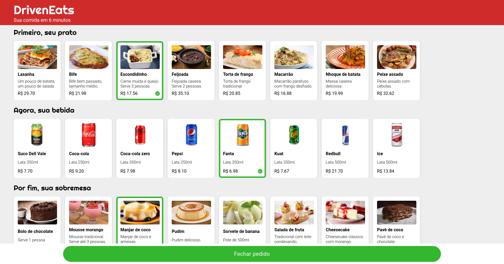
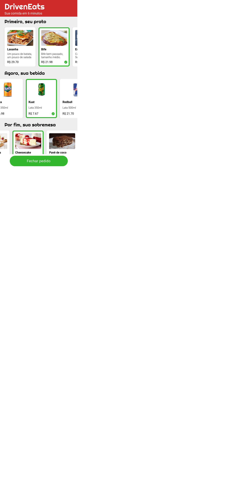

# DrivenEats

A food delivery app / website. This was a solution created for Driven bootcamp. 

## Table of contents

- [Overview](#overview)
  - [The challenge](#the-challenge)
  - [Screenshot](#screenshot)
  - [Links](#links)
- [My process](#my-process)
  - [Built with](#built-with)
- [Author](#author)

## Overview

### The challenge

Users should be able to:

- View the optimal layout for the site depending on their device's screen size
- See hover states for all interactive elements on the page
- Be able to completely order in the app and check the bill before ordering

### Screenshot

|          Desktop view          |          Mobile view          |
| :----------------------------: | :---------------------------: |
|  |  |

### Links

- Live Site URL: [Click here]([https://your-live-site-url.com](https://me-luc.github.io/Driven-Eats/))

## My process

### Built with

- HTML markup
- CSS custom properties
- JavaScript
- Flexbox
- Responsiveness

## Author

-   Linkedin - [Lucas Almeida](https://www.linkedin.com/in/almeida-lucas1/)
-   Frontend Mentor - [@me-luc](https://www.frontendmentor.io/profile/me-luc)

